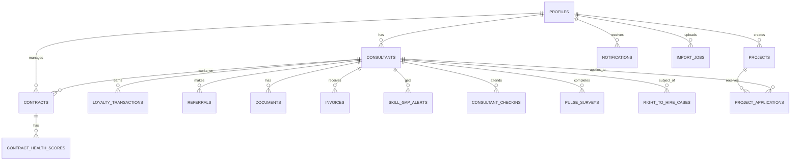
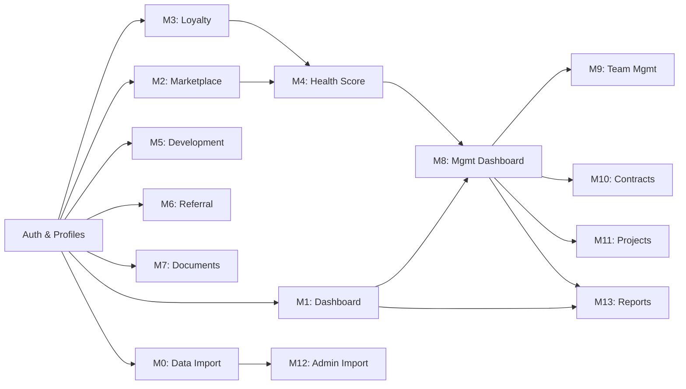

# DOC-0: Architektura i Fundament Projektu Qualrix

**Wersja:** 1.0
**Data:** Luty 2025
**Dla:** B2B.net S.A.
**Aplikacja:** Qualrix - System Zarządzania Konsultantami

---

## 1. Przegląd Projektu

### 1.1 Informacje Podstawowe

**Nazwa aplikacji:** Qualrix (nazwa robocza)
**Organizacja:** B2B.net S.A.
**Typ aplikacji:** Web App (PWA) → Mobile Native (przyszłość)
**Liczba użytkowników docelowych:** 500+ konsultantów + 50+ menedżerów
**Język główny:** Polski (domyślny) + Angielski

### 1.2 Cel i Cele Biznesowe

Qualrix to system zarządzania i wspierania konsultantów IT, zaprojektowany dla firmy zajmującej się outsourcingiem i body-leasingiem. Aplikacja ma wspierać:

- **Retencję konsultantów** - poprzez system lojalności, przejrzystość kontraktów, wsparcie rozwoju
- **Redukcję ryzyka** - poprzez monitoring zdrowia kontraktów, wczesne ostrzeżenia, feedback
- **Automatyzację procesów** - poprzez import danych, workflow'e, raportowanie
- **Autonomię menedżerów** - poprzez intuicyjne dashboardy bez potrzeby IT

### 1.3 Użytkownicy Docelowi

| Rola | Liczba | Dostęp | Kluczowe Zadania |
|------|--------|--------|-----------------|
| **Konsultant** | 500+ | Moduły M1-M7 | Profil, dashboard, projekty, dokumenty, lojalność, rozwój |
| **Delivery Lead** | ~30 | Moduły M8-M13 + pełny przegląd | Zarządzanie zespołem, monitoring zdrowia kontraktów |
| **Account Manager** | ~15 | Moduły M8-M13 + klienci | Zarządzanie klientami, projekty, marża |
| **Consultant Success Manager** | ~5 | Moduły M8-M13 + zaangażowanie | Pulse surveys, check-iny, rekomendacje |
| **Admin/CEO** | 1-2 | Pełny dostęp + konfiguracja | Całość systemu, ustawienia, import danych |

### 1.4 Problem, który rozwiązujemy

B2B.net ma bogatą wiedzę o swoich konsultantach rozproszoną w Excelu, e-mailach i głowach menedżerów. Qualrix centralizuje tę wiedzę w inteligentny system, który:
- Pokazuje zdrowotność kontraktów (czy konsultant pozostanie czy odejdzie?)
- Automatycznie łączy konsultantów z projektami
- Śledzi wzrost zawodowy i certyfikacje
- Zarządza lojalością i bonusami
- Chroni przed "Right to Hire" (gdy klient chce zatrudnić konsultanta bezpośrednio)

---

## 2. Stack Technologiczny

### 2.1 Architektura Ogólna

```
┌─────────────────────────────────────────────────────────────┐
│                    FRONTEND (PWA)                           │
│  Next.js 14+ App Router + React 18 + TypeScript             │
│  UI: Tailwind CSS + shadcn/ui                               │
│  i18n: next-intl (PL/EN)                                    │
│  State: Zustand (lightweight)                               │
│  PWA: next-pwa (mobile-like)                                │
└──────────────────┬──────────────────────────────────────────┘
                   │ HTTPS REST/Realtime
                   │
┌──────────────────┴──────────────────────────────────────────┐
│              BACKEND (Supabase)                             │
│  PostgreSQL + Auth + Storage + Realtime + Edge Functions    │
│  RLS (Row Level Security) na tabele                         │
│  Transactional emails via Resend                            │
└──────────────────┬──────────────────────────────────────────┘
                   │
┌──────────────────┴──────────────────────────────────────────┐
│           HOSTING (Vercel + Supabase)                       │
│  Vercel: Frontend (serverless functions)                    │
│  Supabase: Backend database + auth                          │
└─────────────────────────────────────────────────────────────┘
```

### 2.2 Szczegółowy Opis Technologii

#### Frontend: Next.js 14+ + React 18 + TypeScript

**Dlaczego Next.js?**
- **AI-friendly** - Antygrivity/Bolt generują natywnie kod Next.js
- **Full-stack** - Backend może być w API routes (Edge Functions)
- **Performance** - Image optimization, code splitting, dynamic imports
- **i18n** - next-intl integruje się idealnie z App Router
- **PWA ready** - next-pwa dodaje offline support
- **Vercel deployment** - 1-klik deployment z CI/CD

**React 18** dla Hooks, Suspense, Server Components (przyszłość)

**TypeScript** - zmniejsza błędy, ułatwia AI-generated code review

#### UI Framework: Tailwind CSS + shadcn/ui

**Tailwind CSS** - utility-first CSS framework
- Szybki prototyping
- Konsistent design system
- Lekki output CSS
- Łatwo definiuje się motywy (light/dark)

**shadcn/ui** - reusable React components
- Accessible (wcag 2.1)
- Tailwind + Radix UI
- Copy-paste (nie npm packages) - **kluczowe dla AI**: można łatwo modyfikować kod
- Komponenty: Button, Dialog, Form, Table, Tabs, Card, Badge, itp.

#### Backend: Supabase (PostgreSQL + Auth + Realtime)

**Dlaczego Supabase?**
- **PostgreSQL power** - zaawansowane queries, JSON support, custom functions
- **Auth built-in** - email/password, magic links, SSO (Google/Microsoft)
- **RLS (Row Level Security)** - bezpieczeństwo na poziomie bazy danych
- **Realtime** - live updates dla dashboardów (subscribers notyfikacje)
- **Storage** - plik documents, avatary, csv import
- **Edge Functions** - serverless compute dla logiki biznesowej
- **REST API** - client-side query via @supabase/supabase-js
- **No vendor lock-in** - eksport PostgreSQL w każdej chwili

#### State Management: Zustand

**Dlaczego Zustand, a nie Redux?**
- Bardzo lekki (~1KB)
- Minimalista API - AI buduje kod szybko
- Brak boilerplatu (Redux ma 500 linii boilerplate na store)
- Idealny dla PWA (mniej JS = szybsze)

Alternativa: React Query dla server state (ale Zustand dla UI state)

#### i18n: next-intl

**Dlaczego next-intl?**
- Natywna integracja z Next.js App Router
- Middleware dla automatycznego prefixu `/pl/` lub `/en/`
- Domyślny język: Polski
- Type-safe translations
- Lazy loading messagów

**Struktura:**
```
/messages
  /pl.json
  /en.json
```

#### PWA: next-pwa

**Dlaczego PWA od razu?**
- Works offline (z cached data)
- Install na home screen (iOS/Android)
- Push notifications (przyszłość)
- Pełna baza danych offline (dla CSV import)
- Łatwa migracja na native later

#### Data Import: Papa Parse + SheetJS

**Papa Parse** - CSV parsing
- Stream large files
- Auto-detect delimiters
- Header row detection

**SheetJS (xlsx)** - Excel parsing
- Wielkie arkusze (10k+ rows)
- Formaty .xls, .xlsx, .ods
- Type detection

#### Email: Resend

**Dlaczego Resend?**
- Transactional emails (nie batch marketing)
- 3000 emails/month free tier
- Simple API
- Built-in templates support
- Tracking opens/clicks (premium)

#### Charts: Recharts

- React charts library
- Responsive (mobile-ready)
- Customizable
- Performance (SVG, nie Canvas)

### 2.3 Dlaczego Ten Stack dla AI Builders?

```
✅ Next.js/React code generation - Antygrivity i Bolt
   mają niezliczone przykłady w internecie

✅ TypeScript - AI popełnia mniej błędów z TS

✅ Tailwind CSS - AI doskonale generuje klasy Tailwinda

✅ shadcn/ui - AI zna komponenty, copy-paste do kodu

✅ Supabase - prosty REST API, RLS w SQL
   (AI może pisać SQL lepiej niż złożony ORM)

✅ Zustand - minimal boilerplate, intuicyjny API

✅ next-intl - standardowa konfiguracja, AI to zna
```

💡 **Tip for CEO**: Cały stack jest typu "AI-native" - każda z tych bibliotek ma tysięce przykładów online, które AI builders mogą się wzorować.

---

## 3. Architektura Bazy Danych

### 3.1 Tabele Core

#### Tabela: `profiles` (rozszerzenie Supabase `auth.users`)

```sql
-- Trigger automatycznie tworzy profil przy rejestracji
CREATE TABLE public.profiles (
    id UUID PRIMARY KEY REFERENCES auth.users(id) ON DELETE CASCADE,
    email TEXT NOT NULL UNIQUE,
    full_name TEXT,
    phone TEXT,

    -- Role: consultant, delivery_lead, account_manager, csm, admin
    role TEXT NOT NULL DEFAULT 'consultant',
    CHECK (role IN ('consultant', 'delivery_lead', 'account_manager', 'csm', 'admin')),

    avatar_url TEXT,
    preferred_language TEXT DEFAULT 'pl',
    CHECK (preferred_language IN ('pl', 'en')),

    created_at TIMESTAMP WITH TIME ZONE DEFAULT NOW(),
    updated_at TIMESTAMP WITH TIME ZONE DEFAULT NOW()
);

CREATE INDEX idx_profiles_role ON public.profiles(role);
CREATE INDEX idx_profiles_email ON public.profiles(email);
```

#### Tabela: `consultants` (profil rozszerzony konsultanta)

```sql
CREATE TABLE public.consultants (
    id UUID PRIMARY KEY DEFAULT gen_random_uuid(),
    profile_id UUID NOT NULL UNIQUE REFERENCES public.profiles(id) ON DELETE CASCADE,

    -- Status zawodowy
    current_status TEXT NOT NULL DEFAULT 'active',
    CHECK (current_status IN ('active', 'ending', 'ended', 'alumni')),

    -- Dane zawodowe
    specialization TEXT, -- np. "Java Developer", "DevOps"
    seniority_level TEXT, -- junior, mid, senior, lead
    technologies TEXT[] DEFAULT ARRAY[]::TEXT[], -- {"Java", "Spring Boot", "PostgreSQL"}
    certifications TEXT[] DEFAULT ARRAY[]::TEXT[], -- {"AWS Solutions Architect", "CKA"}
    years_experience DECIMAL(3, 1) DEFAULT 0,

    -- Preferencje
    preferred_work_mode TEXT, -- remote, hybrid, onsite
    preferred_location TEXT, -- np. "Warszawa", "Wrocław"

    -- Finansowe
    current_rate DECIMAL(8, 2), -- kwota per godzinę

    -- Social
    linkedin_url TEXT,

    -- Lojalność
    loyalty_points INTEGER DEFAULT 0,
    loyalty_status TEXT DEFAULT 'bronze', -- bronze, silver, gold, platinum
    CHECK (loyalty_status IN ('bronze', 'silver', 'gold', 'platinum')),

    -- Health
    health_score DECIMAL(3, 1) DEFAULT 5.0, -- 0-10 skala

    notes TEXT,

    created_at TIMESTAMP WITH TIME ZONE DEFAULT NOW(),
    updated_at TIMESTAMP WITH TIME ZONE DEFAULT NOW()
);

CREATE INDEX idx_consultants_profile_id ON public.consultants(profile_id);
CREATE INDEX idx_consultants_status ON public.consultants(current_status);
CREATE INDEX idx_consultants_loyalty ON public.consultants(loyalty_status);
CREATE INDEX idx_consultants_specialization ON public.consultants(specialization);
```

### 3.2 Tabele Kontraktów

#### Tabela: `contracts`

```sql
CREATE TABLE public.contracts (
    id UUID PRIMARY KEY DEFAULT gen_random_uuid(),
    consultant_id UUID NOT NULL REFERENCES public.consultants(id) ON DELETE CASCADE,

    -- Dane klienta
    client_name TEXT NOT NULL, -- nazwa rzeczywista klienta
    project_name TEXT NOT NULL,

    -- Daty
    start_date DATE NOT NULL,
    end_date DATE,

    -- Finansowe
    rate_per_hour DECIMAL(8, 2) NOT NULL,

    -- Warunki
    work_mode TEXT, -- remote, hybrid, onsite
    location TEXT,

    -- Status
    status TEXT NOT NULL DEFAULT 'active',
    CHECK (status IN ('active', 'ending', 'ended', 'terminated')),

    -- Przedłużenia
    is_extended BOOLEAN DEFAULT FALSE,
    extension_count INTEGER DEFAULT 0,

    created_at TIMESTAMP WITH TIME ZONE DEFAULT NOW(),
    updated_at TIMESTAMP WITH TIME ZONE DEFAULT NOW()
);

CREATE INDEX idx_contracts_consultant ON public.contracts(consultant_id);
CREATE INDEX idx_contracts_status ON public.contracts(status);
CREATE INDEX idx_contracts_dates ON public.contracts(start_date, end_date);
```

#### Tabela: `contract_health_scores`

```sql
CREATE TABLE public.contract_health_scores (
    id UUID PRIMARY KEY DEFAULT gen_random_uuid(),
    contract_id UUID NOT NULL UNIQUE REFERENCES public.contracts(id) ON DELETE CASCADE,

    -- Komponenty zdrowotności (0-10)
    overall_score DECIMAL(3, 1) NOT NULL, -- średnia ważona
    client_feedback_score DECIMAL(3, 1), -- feedback od klienta
    stability_score DECIMAL(3, 1), -- czy kontrakt będzie przedłużony?
    engagement_score DECIMAL(3, 1), -- czy konsultant jest zaangażowany?
    red_flags_score DECIMAL(3, 1), -- brak check-inów, negatywny feedback

    calculated_at TIMESTAMP WITH TIME ZONE DEFAULT NOW()
);

CREATE INDEX idx_health_contract ON public.contract_health_scores(contract_id);
CREATE INDEX idx_health_overall ON public.contract_health_scores(overall_score);
```

### 3.3 Tabele Marketplace

#### Tabela: `projects`

```sql
CREATE TABLE public.projects (
    id UUID PRIMARY KEY DEFAULT gen_random_uuid(),

    -- Dane projektu
    title TEXT NOT NULL,
    description TEXT,

    -- Klient
    client_name TEXT NOT NULL, -- nazwa rzeczywista
    client_brand TEXT, -- marka dla brandy (nullable)

    -- Wymagania
    technologies_required TEXT[] DEFAULT ARRAY[]::TEXT[],
    seniority_required TEXT, -- junior, mid, senior, lead, any
    rate_min DECIMAL(8, 2),
    rate_max DECIMAL(8, 2),

    -- Warunki
    work_mode TEXT, -- remote, hybrid, onsite
    location TEXT,

    -- Oferta
    status TEXT NOT NULL DEFAULT 'open',
    CHECK (status IN ('open', 'pipeline', 'closed', 'filled')),

    -- Dostęp
    is_exclusive TEXT, -- null, 'gold', 'platinum' (tylko dla określonych statusów)
    visibility TEXT DEFAULT 'public', -- public, exclusive

    estimated_start DATE,

    created_by UUID NOT NULL REFERENCES public.profiles(id),
    created_at TIMESTAMP WITH TIME ZONE DEFAULT NOW()
);

CREATE INDEX idx_projects_status ON public.projects(status);
CREATE INDEX idx_projects_created_by ON public.projects(created_by);
```

#### Tabela: `project_applications`

```sql
CREATE TABLE public.project_applications (
    id UUID PRIMARY KEY DEFAULT gen_random_uuid(),
    project_id UUID NOT NULL REFERENCES public.projects(id) ON DELETE CASCADE,
    consultant_id UUID NOT NULL REFERENCES public.consultants(id) ON DELETE CASCADE,

    -- Matching
    matching_score DECIMAL(3, 1), -- 0-10, na podstawie skills/seniority

    -- Status aplikacji
    status TEXT NOT NULL DEFAULT 'interested',
    CHECK (status IN ('interested', 'in_review', 'accepted', 'rejected')),

    applied_at TIMESTAMP WITH TIME ZONE DEFAULT NOW(),

    UNIQUE(project_id, consultant_id)
);

CREATE INDEX idx_apps_project ON public.project_applications(project_id);
CREATE INDEX idx_apps_consultant ON public.project_applications(consultant_id);
CREATE INDEX idx_apps_status ON public.project_applications(status);
```

### 3.4 Tabele Lojalności

#### Tabela: `loyalty_transactions`

```sql
CREATE TABLE public.loyalty_transactions (
    id UUID PRIMARY KEY DEFAULT gen_random_uuid(),
    consultant_id UUID NOT NULL REFERENCES public.consultants(id) ON DELETE CASCADE,

    points INTEGER NOT NULL,

    activity_type TEXT NOT NULL,
    -- monthly_active: 10 pkt/miesiąc (aktywny w systemie)
    -- contract_extension: 50 pkt (przedłużenie kontraktu)
    -- referral_hired: 200 pkt (polecony znalazł pracę)
    -- smooth_transition: 30 pkt (gładkie zakończenie)
    -- positive_feedback: 25 pkt (feedback od klienta)
    -- certification: 40 pkt (nowa certyfikacja)
    -- anniversary: 100 pkt (rocznica w systemie)

    description TEXT,
    reference_id UUID, -- contract_id, referral_id, itp.

    created_at TIMESTAMP WITH TIME ZONE DEFAULT NOW()
);

CREATE INDEX idx_loyalty_consultant ON public.loyalty_transactions(consultant_id);
CREATE INDEX idx_loyalty_activity ON public.loyalty_transactions(activity_type);
```

### 3.5 Tabele Referrali

#### Tabela: `referrals`

```sql
CREATE TABLE public.referrals (
    id UUID PRIMARY KEY DEFAULT gen_random_uuid(),

    -- Kto polecił
    referrer_id UUID NOT NULL REFERENCES public.consultants(id) ON DELETE CASCADE,

    -- Dane polecenia
    referred_name TEXT NOT NULL,
    referred_email TEXT NOT NULL,
    referred_phone TEXT,
    referred_specialization TEXT,
    referred_linkedin TEXT,

    -- Status
    status TEXT NOT NULL DEFAULT 'submitted',
    CHECK (status IN ('submitted', 'in_recruitment', 'hired', 'on_project', 'rejected')),

    -- Bonusy (tylko gdy hired/on_project)
    bonus_points_awarded INTEGER DEFAULT 0,
    bonus_cash_awarded DECIMAL(8, 2), -- w PLN

    created_at TIMESTAMP WITH TIME ZONE DEFAULT NOW(),
    updated_at TIMESTAMP WITH TIME ZONE DEFAULT NOW()
);

CREATE INDEX idx_referrals_referrer ON public.referrals(referrer_id);
CREATE INDEX idx_referrals_status ON public.referrals(status);
```

### 3.6 Tabele Dokumentów i Finansów

#### Tabela: `documents`

```sql
CREATE TABLE public.documents (
    id UUID PRIMARY KEY DEFAULT gen_random_uuid(),
    consultant_id UUID NOT NULL REFERENCES public.consultants(id) ON DELETE CASCADE,

    -- Typ dokumentu
    type TEXT NOT NULL,
    CHECK (type IN ('contract', 'amendment', 'invoice', 'certificate', 'other')),

    title TEXT NOT NULL,
    file_url TEXT NOT NULL, -- Supabase Storage URL

    uploaded_at TIMESTAMP WITH TIME ZONE DEFAULT NOW()
);

CREATE INDEX idx_documents_consultant ON public.documents(consultant_id);
CREATE INDEX idx_documents_type ON public.documents(type);
```

#### Tabela: `invoices`

```sql
CREATE TABLE public.invoices (
    id UUID PRIMARY KEY DEFAULT gen_random_uuid(),
    consultant_id UUID NOT NULL REFERENCES public.consultants(id) ON DELETE CASCADE,

    invoice_number TEXT NOT NULL UNIQUE,
    amount DECIMAL(10, 2) NOT NULL,
    currency TEXT DEFAULT 'PLN',

    issue_date DATE NOT NULL,
    due_date DATE NOT NULL,

    payment_status TEXT NOT NULL DEFAULT 'pending',
    CHECK (payment_status IN ('pending', 'processing', 'paid')),

    paid_at TIMESTAMP WITH TIME ZONE,

    created_at TIMESTAMP WITH TIME ZONE DEFAULT NOW()
);

CREATE INDEX idx_invoices_consultant ON public.invoices(consultant_id);
CREATE INDEX idx_invoices_status ON public.invoices(payment_status);
```

### 3.7 Tabele Rozwoju

#### Tabela: `skill_gap_alerts`

```sql
CREATE TABLE public.skill_gap_alerts (
    id UUID PRIMARY KEY DEFAULT gen_random_uuid(),
    consultant_id UUID NOT NULL REFERENCES public.consultants(id) ON DELETE CASCADE,

    skill_name TEXT NOT NULL, -- np. "Kubernetes", "React 19"
    recommendation TEXT, -- np. "CKA certification recommended"
    course_url TEXT, -- link do kursu

    is_read BOOLEAN DEFAULT FALSE,

    created_at TIMESTAMP WITH TIME ZONE DEFAULT NOW()
);

CREATE INDEX idx_alerts_consultant ON public.skill_gap_alerts(consultant_id);
CREATE INDEX idx_alerts_read ON public.skill_gap_alerts(is_read);
```

### 3.8 Tabele Managementu

#### Tabela: `consultant_checkins`

```sql
CREATE TABLE public.consultant_checkins (
    id UUID PRIMARY KEY DEFAULT gen_random_uuid(),
    consultant_id UUID NOT NULL REFERENCES public.consultants(id) ON DELETE CASCADE,
    manager_id UUID NOT NULL REFERENCES public.profiles(id),

    notes TEXT,
    next_checkin_date DATE,

    created_at TIMESTAMP WITH TIME ZONE DEFAULT NOW()
);

CREATE INDEX idx_checkins_consultant ON public.consultant_checkins(consultant_id);
CREATE INDEX idx_checkins_manager ON public.consultant_checkins(manager_id);
```

#### Tabela: `pulse_surveys`

```sql
CREATE TABLE public.pulse_surveys (
    id UUID PRIMARY KEY DEFAULT gen_random_uuid(),
    consultant_id UUID NOT NULL REFERENCES public.consultants(id) ON DELETE CASCADE,

    -- Skala 1-5
    satisfaction_score SMALLINT CHECK (satisfaction_score >= 1 AND satisfaction_score <= 5),
    engagement_score SMALLINT CHECK (engagement_score >= 1 AND engagement_score <= 5),
    recommendation_score SMALLINT CHECK (recommendation_score >= 1 AND recommendation_score <= 5),

    comment TEXT,

    submitted_at TIMESTAMP WITH TIME ZONE DEFAULT NOW()
);

CREATE INDEX idx_surveys_consultant ON public.pulse_surveys(consultant_id);
```

#### Tabela: `right_to_hire_cases`

```sql
CREATE TABLE public.right_to_hire_cases (
    id UUID PRIMARY KEY DEFAULT gen_random_uuid(),
    consultant_id UUID NOT NULL REFERENCES public.consultants(id) ON DELETE CASCADE,

    client_name TEXT NOT NULL,
    detection_signals TEXT, -- np. "Klient zapytał o bezpośrednie zatrudnienie"

    fee_calculated DECIMAL(10, 2), -- kwota do negocjacji
    fee_currency TEXT DEFAULT 'PLN',

    status TEXT NOT NULL DEFAULT 'detected',
    CHECK (status IN ('detected', 'negotiating', 'invoiced', 'settled', 'lost')),

    created_at TIMESTAMP WITH TIME ZONE DEFAULT NOW()
);

CREATE INDEX idx_rth_consultant ON public.right_to_hire_cases(consultant_id);
CREATE INDEX idx_rth_status ON public.right_to_hire_cases(status);
```

### 3.9 Tabele Notyfikacji

#### Tabela: `notifications`

```sql
CREATE TABLE public.notifications (
    id UUID PRIMARY KEY DEFAULT gen_random_uuid(),
    user_id UUID NOT NULL REFERENCES public.profiles(id) ON DELETE CASCADE,

    -- Typ notyfikacji dla routing'u
    type TEXT NOT NULL, -- email_received, contract_ending, loyalty_achieved, itp.

    -- Treść (bilingual)
    title_pl TEXT NOT NULL,
    title_en TEXT NOT NULL,
    body_pl TEXT,
    body_en TEXT,

    is_read BOOLEAN DEFAULT FALSE,
    action_url TEXT, -- gdzieś kliknąć w app

    created_at TIMESTAMP WITH TIME ZONE DEFAULT NOW()
);

CREATE INDEX idx_notifications_user ON public.notifications(user_id);
CREATE INDEX idx_notifications_read ON public.notifications(is_read);
```

### 3.10 Tabela Import Danych

#### Tabela: `import_jobs`

```sql
CREATE TABLE public.import_jobs (
    id UUID PRIMARY KEY DEFAULT gen_random_uuid(),
    uploaded_by UUID NOT NULL REFERENCES public.profiles(id),

    file_name TEXT NOT NULL,
    file_url TEXT NOT NULL, -- Supabase Storage

    status TEXT NOT NULL DEFAULT 'pending',
    CHECK (status IN ('pending', 'processing', 'completed', 'failed')),

    records_total INTEGER,
    records_imported INTEGER DEFAULT 0,
    records_failed INTEGER DEFAULT 0,

    error_log TEXT, -- JSON z błędami per row

    created_at TIMESTAMP WITH TIME ZONE DEFAULT NOW(),
    completed_at TIMESTAMP WITH TIME ZONE
);

CREATE INDEX idx_import_status ON public.import_jobs(status);
CREATE INDEX idx_import_user ON public.import_jobs(uploaded_by);
```

### 3.11 Diagram ER (Mermaid)



### 3.12 Trigger Automatyzacji

```sql
-- Trigger: Stwórz profil quando user się rejestruje
CREATE OR REPLACE FUNCTION public.handle_new_user()
RETURNS TRIGGER AS $$
BEGIN
  INSERT INTO public.profiles (id, email, full_name, role)
  VALUES (new.id, new.email, new.raw_user_meta_data ->> 'full_name', 'consultant');
  RETURN new;
END;
$$ LANGUAGE plpgsql SECURITY DEFINER;

CREATE TRIGGER on_auth_user_created
  AFTER INSERT ON auth.users
  FOR EACH ROW EXECUTE FUNCTION public.handle_new_user();

-- Trigger: Aktualizuj loyalty_status na podstawie punktów
CREATE OR REPLACE FUNCTION public.update_loyalty_status()
RETURNS TRIGGER AS $$
BEGIN
  UPDATE public.consultants
  SET loyalty_status = CASE
    WHEN loyalty_points >= 500 THEN 'platinum'
    WHEN loyalty_points >= 300 THEN 'gold'
    WHEN loyalty_points >= 100 THEN 'silver'
    ELSE 'bronze'
  END
  WHERE id = NEW.consultant_id;
  RETURN NEW;
END;
$$ LANGUAGE plpgsql;

CREATE TRIGGER on_loyalty_transaction
  AFTER INSERT ON public.loyalty_transactions
  FOR EACH ROW EXECUTE FUNCTION public.update_loyalty_status();

-- Trigger: Aktualizuj updated_at
CREATE OR REPLACE FUNCTION public.update_updated_at()
RETURNS TRIGGER AS $$
BEGIN
  NEW.updated_at = NOW();
  RETURN NEW;
END;
$$ LANGUAGE plpgsql;

CREATE TRIGGER update_consultants_updated_at
  BEFORE UPDATE ON public.consultants
  FOR EACH ROW EXECUTE FUNCTION public.update_updated_at();

CREATE TRIGGER update_contracts_updated_at
  BEFORE UPDATE ON public.contracts
  FOR EACH ROW EXECUTE FUNCTION public.update_updated_at();
```

---

## 4. System Autoryzacji i Ról

### 4.1 Autentykacja

Supabase Auth zapewnia:
- Email/Password (standard)
- Magic Links (bez hasła, bezpieczniej)
- SSO: Google, Microsoft (future impl)
- 2FA (future)

**Proces Rejestracji:**
1. Użytkownik rejestruje się email + password
2. Automatycznie tworzy się `profiles` entry z `role = 'consultant'`
3. Admin zmienia role w dashboard (M10: Admin Panel)

### 4.2 Role i Uprawnienia

| Role | Widzi | Może Edytować |
|------|-------|---------------|
| **consultant** | Tylko siebie | Swój profil, preferencje |
| **delivery_lead** | Swój zespół + full data | Profile zespołu, check-iny, feedback |
| **account_manager** | Klientów + swoje projekty | Projekty, rate cards |
| **csm** | Consultants (engagement) | Pulse surveys, recommendations |
| **admin** | Wszystko | Wszystko |

### 4.3 Row Level Security (RLS)

RLS to mechanizm na poziomie bazy danych, który automatycznie filtruje dane na podstawie logged-in user'a.

#### RLS Policy: Consultants widzą tylko siebie

```sql
CREATE POLICY "consultants_can_view_own_profile"
  ON public.profiles FOR SELECT
  USING (
    auth.uid() = id OR
    (SELECT role FROM public.profiles WHERE id = auth.uid()) = 'admin'
  );

CREATE POLICY "consultants_can_update_own_profile"
  ON public.profiles FOR UPDATE
  USING (auth.uid() = id)
  WITH CHECK (auth.uid() = id);
```

#### RLS Policy: Consultants widzą tylko swoje dane

```sql
CREATE POLICY "consultants_own_data"
  ON public.consultants FOR SELECT
  USING (
    profile_id = auth.uid() OR
    -- Delivery Lead widzi swój zespół
    auth.uid() IN (
      SELECT id FROM public.profiles
      WHERE role = 'delivery_lead'
    ) OR
    -- Admin widzi wszystko
    (SELECT role FROM public.profiles WHERE id = auth.uid()) = 'admin'
  );
```

#### RLS Policy: Admini mają pełny dostęp

```sql
CREATE POLICY "admins_have_full_access"
  ON public.consultants FOR ALL
  USING ((SELECT role FROM public.profiles WHERE id = auth.uid()) = 'admin');
```

#### RLS Policy: Marketplace - tylko active projects

```sql
CREATE POLICY "can_view_public_projects"
  ON public.projects FOR SELECT
  USING (
    visibility = 'public' AND status != 'closed'
    OR
    created_by = auth.uid()
    OR
    (SELECT role FROM public.profiles WHERE id = auth.uid()) IN ('admin', 'delivery_lead')
  );
```

### 4.4 Włączenie RLS (Critical!)

```sql
-- Włącz RLS na wszystkie tabele
ALTER TABLE public.profiles ENABLE ROW LEVEL SECURITY;
ALTER TABLE public.consultants ENABLE ROW LEVEL SECURITY;
ALTER TABLE public.contracts ENABLE ROW LEVEL SECURITY;
ALTER TABLE public.projects ENABLE ROW LEVEL SECURITY;
ALTER TABLE public.notifications ENABLE ROW LEVEL SECURITY;
-- ... (dla wszystkich tabel publicznych)

-- Domyślnie: DENY all (least privilege)
CREATE POLICY "deny_all"
  ON public.consultants AS (SELECT) USING (FALSE)
  WHERE (SELECT role FROM public.profiles WHERE id = auth.uid()) != 'admin';
```

💡 **Tip for CEO**: RLS to najważniejsze dla bezpieczeństwa. Konsultant zawsze widzi tylko swoje dane, niezależnie co wysyła API. Nie możesz "zhackować" sobie dostęp do czyichś danych poprzez curl.

---

## 5. Internacjonalizacja (i18n)

### 5.1 Konfiguracja next-intl

Plik: `/src/i18n.ts`

```typescript
import { notFound } from 'next/navigation';
import { getRequestConfig } from 'next-intl/server';

const locales = ['pl', 'en'];
const defaultLocale = 'pl';

export default getRequestConfig(async ({ locale }) => {
  // Validate locale
  if (!locales.includes(locale as any)) notFound();

  return {
    messages: (
      await import(`../../messages/${locale}.json`)
    ).default
  };
});
```

### 5.2 Struktura Plików Translations

```
/messages
  /pl.json    # Główny język (domyślny)
  /en.json    # Język angielski
```

### 5.3 Przykład: `/messages/pl.json`

```json
{
  "navigation": {
    "dashboard": "Dashboard",
    "marketplace": "Marketplace",
    "loyalty": "Program Lojalności",
    "documents": "Dokumenty",
    "development": "Rozwój",
    "referral": "Polecenia",
    "health": "Zdrowotność",
    "profile": "Profil"
  },
  "common": {
    "save": "Zapisz",
    "cancel": "Anuluj",
    "delete": "Usuń",
    "edit": "Edytuj",
    "loading": "Ładowanie...",
    "error": "Błąd",
    "success": "Sukces"
  },
  "consultant": {
    "current_status": "Obecny Status",
    "specialization": "Specjalizacja",
    "seniority_level": "Poziom Seniority",
    "years_experience": "Lata Doświadczenia"
  },
  "loyalty": {
    "bronze": "Brąz",
    "silver": "Srebro",
    "gold": "Złoto",
    "platinum": "Platyna",
    "points": "Punkty",
    "monthly_active": "Aktywny w systemie",
    "contract_extension": "Przedłużenie umowy",
    "referral_hired": "Polecenie zatrudnione",
    "smooth_transition": "Gładkie przejście",
    "positive_feedback": "Pozytywny feedback"
  }
}
```

### 5.4 Przykład: `/messages/en.json`

```json
{
  "navigation": {
    "dashboard": "Dashboard",
    "marketplace": "Marketplace",
    "loyalty": "Loyalty Program",
    "documents": "Documents",
    "development": "Development",
    "referral": "Referrals",
    "health": "Health Score",
    "profile": "Profile"
  },
  "common": {
    "save": "Save",
    "cancel": "Cancel",
    "delete": "Delete",
    "edit": "Edit",
    "loading": "Loading...",
    "error": "Error",
    "success": "Success"
  }
}
```

### 5.5 Middleware (App Router)

Plik: `/src/middleware.ts`

```typescript
import createMiddleware from 'next-intl/middleware';

export default createMiddleware({
  locales: ['pl', 'en'],
  defaultLocale: 'pl',
  localePrefix: 'always'
});

export const config = {
  matcher: ['/((?!_next|_vercel|.*\\..*).*)']
};
```

### 5.6 Hook w Komponencie

```typescript
import { useTranslations } from 'next-intl';

export function DashboardHeader() {
  const t = useTranslations('navigation');

  return (
    <h1>{t('dashboard')}</h1>
  );
}
```

### 5.7 Language Switcher Component

```typescript
'use client';

import { useLocale } from 'next-intl';
import { usePathname, useRouter } from 'next/navigation';

export function LanguageSwitcher() {
  const locale = useLocale();
  const router = useRouter();
  const pathname = usePathname();

  const handleSwitch = (newLocale: string) => {
    const newPath = pathname.replace(`/${locale}/`, `/${newLocale}/`);
    router.push(newPath);
  };

  return (
    <div className="flex gap-2">
      <button
        onClick={() => handleSwitch('pl')}
        className={locale === 'pl' ? 'font-bold' : ''}
      >
        PL
      </button>
      <button
        onClick={() => handleSwitch('en')}
        className={locale === 'en' ? 'font-bold' : ''}
      >
        EN
      </button>
    </div>
  );
}
```

---

## 6. Design System

### 6.1 Paleta Kolorów

```
Podstawowe:
  PRIMARY (B2B.net Red):    #E3000F    (Accent, buttons, highlights)
  SECONDARY (Dark Blue):    #1F3A70    (Headers, navigation)

Semantic:
  SUCCESS (Green):          #10B981    (Positive, completion)
  WARNING (Yellow):         #F59E0B    (Caution, attention)
  DANGER (Red):             #EF4444    (Errors, negative states)

Neutral:
  GRAY-50:                  #F9FAFB
  GRAY-100:                 #F3F4F6
  GRAY-200:                 #E5E7EB
  GRAY-300:                 #D1D5DB
  GRAY-400:                 #9CA3AF
  GRAY-500:                 #6B7280
  GRAY-600:                 #4B5563
  GRAY-700:                 #374151
  GRAY-800:                 #1F2937
  GRAY-900:                 #111827
```

**Loyalty Status Colors:**
```
Bronze:  #CD7F32   (miedziany)
Silver:  #C0C0C0   (srebrny)
Gold:    #FFD700   (złoty)
Platinum: #E5E4E2  (platynowy - jasny szary z błyszczeniem)
```

### 6.2 Typografia

**Headings:**
- Font: `Inter` (Google Fonts)
- Weight: 600-700 (SemiBold-Bold)
- Sizes: H1 (2rem), H2 (1.5rem), H3 (1.25rem), H4 (1.125rem)

**Body Text:**
- Font: System fonts (`-apple-system, BlinkMacSystemFont, "Segoe UI", Roboto`)
- Weight: 400-500
- Size: 1rem (16px)
- Line-height: 1.5

**Code:**
- Font: `Fira Code` or `JetBrains Mono`
- Size: 0.875rem

### 6.3 shadcn/ui Komponenty do Użycia

```
✓ Button          - CTA, primary/secondary/outline variants
✓ Card            - Content containers
✓ Dialog          - Modals
✓ Tabs            - Section navigation
✓ Table           - Data display
✓ Form            - Input fields
✓ Input           - Text inputs
✓ Textarea        - Multi-line text
✓ Select          - Dropdown selects
✓ Checkbox        - Boolean inputs
✓ Badge           - Tags, status labels
✓ Alert           - Messages
✓ Toast/Sonner    - Notifications
✓ Breadcrumb      - Navigation path
✓ Dropdown Menu   - User menu
✓ Sidebar         - Main navigation (desktop)
✓ Sheet           - Drawer/Offcanvas (mobile)
✓ Progress        - Loading bars
✓ Skeleton        - Content loaders
✓ Avatar          - User photos
```

### 6.4 Komponenty Custom: Health Score

```typescript
interface HealthScoreProps {
  score: number; // 0-10
  size?: 'sm' | 'md' | 'lg';
}

export function HealthScore({ score, size = 'md' }: HealthScoreProps) {
  const getColor = (s: number) => {
    if (s >= 7) return 'text-green-500';
    if (s >= 5) return 'text-yellow-500';
    return 'text-red-500';
  };

  const sizeClass = {
    sm: 'w-12 h-12',
    md: 'w-16 h-16',
    lg: 'w-20 h-20'
  }[size];

  return (
    <div className={`rounded-full border-4 flex items-center justify-center font-bold ${sizeClass} ${getColor(score)}`}>
      {score.toFixed(1)}
    </div>
  );
}
```

### 6.5 Komponenty Custom: Loyalty Badge

```typescript
type LoyaltyStatus = 'bronze' | 'silver' | 'gold' | 'platinum';

const loyaltyColors = {
  bronze: 'bg-amber-700 text-white',
  silver: 'bg-slate-300 text-gray-900',
  gold: 'bg-yellow-400 text-gray-900',
  platinum: 'bg-slate-100 text-gray-900 border border-gray-300'
};

export function LoyaltyBadge({ status, points }: { status: LoyaltyStatus; points: number }) {
  return (
    <div className={`px-3 py-1 rounded-full text-sm font-semibold ${loyaltyColors[status]}`}>
      {status.charAt(0).toUpperCase() + status.slice(1)} • {points} pkt
    </div>
  );
}
```

### 6.6 Layout: Desktop (Sidebar Navigation)

```
┌─────────────────────────────────────────┐
│ B2B.net Qualrix      [Lang] [User Menu] │
├──────────────┬────────────────────────────┤
│              │                            │
│  Dashboard   │                            │
│  Marketplace │      MAIN CONTENT          │
│  Loyalty     │      (page content)        │
│  Documents   │                            │
│  Development │                            │
│  Referral    │                            │
│  Profile     │                            │
│              │                            │
└──────────────┴────────────────────────────┘
```

### 6.7 Layout: Mobile (Bottom Tabs)

```
┌────────────────────────┐
│  B2B.net Qualrix [≡]   │
├────────────────────────┤
│                        │
│                        │
│  PAGE CONTENT          │
│                        │
│                        │
├────────────────────────┤
│🏠│🏢│❤️ │📄│👤│⋮│
│Home|Market|...|Profile|More│
└────────────────────────┘
```

### 6.8 Responsive Breakpoints

```
Mobile:     < 640px   (sm)
Tablet:     640px+    (md, lg)
Desktop:    1024px+   (xl, 2xl)
```

Tailwind breakpoints: `sm:`, `md:`, `lg:`, `xl:`, `2xl:`

---

## 7. Struktura Projektu (File Structure)

### 7.1 Całość projektu Next.js

```
qualrix-app/
├── app/
│   ├── layout.tsx                    # Root layout
│   ├── page.tsx                      # Landing page (redirect do /pl)
│   ├── api/
│   │   ├── auth/
│   │   │   └── callback/route.ts     # OAuth callback
│   │   ├── upload/route.ts           # File upload to Supabase
│   │   ├── import/route.ts           # CSV/Excel import processor
│   │   └── cron/
│   │       ├── health-score/route.ts # Trigger: recalculate health scores
│   │       └── loyalty/route.ts      # Trigger: monthly loyalty points
│   │
│   ├── [locale]/
│   │   ├── layout.tsx                # Locale layout
│   │   ├── page.tsx                  # Home (redirect based on role)
│   │   │
│   │   ├── consultant/               # M1-M7 (Frontend modules)
│   │   │   ├── layout.tsx            # Consultant sidebar layout
│   │   │   ├── dashboard/            # M1: Dashboard
│   │   │   │   └── page.tsx
│   │   │   ├── marketplace/          # M2: Marketplace & Applications
│   │   │   │   ├── page.tsx
│   │   │   │   └── [projectId]/page.tsx
│   │   │   ├── loyalty/              # M3: Loyalty Program
│   │   │   │   └── page.tsx
│   │   │   ├── health-score/         # M4: Health Score Monitoring
│   │   │   │   └── page.tsx
│   │   │   ├── development/          # M5: Skill Development
│   │   │   │   └── page.tsx
│   │   │   ├── referral/             # M6: Referral Program
│   │   │   │   └── page.tsx
│   │   │   ├── documents/            # M7: Documents & Finance
│   │   │   │   └── page.tsx
│   │   │   └── profile/              # User Profile
│   │   │       └── page.tsx
│   │   │
│   │   ├── admin/                    # M8-M13 (Back modules)
│   │   │   ├── layout.tsx            # Admin sidebar layout
│   │   │   ├── dashboard/            # M8: Management Dashboard
│   │   │   │   └── page.tsx
│   │   │   ├── team/                 # M9: Team Management
│   │   │   │   ├── page.tsx
│   │   │   │   └── [consultantId]/page.tsx
│   │   │   ├── contracts/            # M10: Contract Management
│   │   │   │   └── page.tsx
│   │   │   ├── projects/             # M11: Project Management
│   │   │   │   ├── page.tsx
│   │   │   │   └── [projectId]/page.tsx
│   │   │   ├── import/               # M12: Data Import Module
│   │   │   │   └── page.tsx
│   │   │   ├── reports/              # M13: Reports & Analytics
│   │   │   │   └── page.tsx
│   │   │   └── settings/             # Admin Settings
│   │   │       └── page.tsx
│   │   │
│   │   ├── auth/
│   │   │   ├── login/page.tsx
│   │   │   ├── signup/page.tsx
│   │   │   └── forgot-password/page.tsx
│   │   │
│   │   └── error.tsx                 # Error boundary
│   │
│   └── error.tsx
│
├── components/
│   ├── shared/                       # Components across app
│   │   ├── Header.tsx
│   │   ├── Sidebar.tsx
│   │   ├── MobileNav.tsx
│   │   ├── LanguageSwitcher.tsx
│   │   └── HealthScore.tsx
│   │
│   ├── consultant/                   # Consultant-specific components
│   │   ├── DashboardCard.tsx
│   │   ├── ProjectCard.tsx
│   │   └── LoyaltyProgressBar.tsx
│   │
│   ├── admin/                        # Admin-specific components
│   │   ├── ConsultantTable.tsx
│   │   ├── HealthScoreGrid.tsx
│   │   └── ReportChart.tsx
│   │
│   └── ui/                           # shadcn/ui components
│       ├── button.tsx
│       ├── card.tsx
│       ├── dialog.tsx
│       ├── form.tsx
│       ├── input.tsx
│       ├── table.tsx
│       └── [... więcej componenów ...]
│
├── lib/
│   ├── supabase.ts                   # Supabase client + helpers
│   ├── auth.ts                       # Auth helpers
│   ├── database.ts                   # DB queries
│   ├── types.ts                      # TypeScript types/interfaces
│   ├── utils.ts                      # Utility functions
│   ├── health-score.ts               # Health score calculations
│   ├── loyalty.ts                    # Loyalty calculations
│   ├── matching.ts                   # Project matching algorithm
│   └── validators.ts                 # Zod validators
│
├── hooks/
│   ├── useConsultant.ts
│   ├── useProjects.ts
│   ├── useLoyalty.ts
│   ├── useHealthScore.ts
│   └── useAuth.ts
│
├── store/                            # Zustand stores
│   ├── authStore.ts
│   ├── consultantStore.ts
│   ├── uiStore.ts
│   └── notificationStore.ts
│
├── messages/                         # Translations
│   ├── pl.json
│   └── en.json
│
├── public/
│   ├── logo.svg
│   ├── favicon.ico
│   ├── manifest.json                 # PWA manifest
│   └── icons/
│       ├── icon-192x192.png
│       └── icon-512x512.png
│
├── styles/
│   ├── globals.css
│   └── theme.css
│
├── i18n.ts                           # next-intl config
├── middleware.ts                     # Middleware (locale routing)
├── next.config.js
├── tailwind.config.ts
├── tsconfig.json
├── .env.local                        # Local env vars
├── .env.example                      # Example env vars
├── package.json
└── README.md
```

### 7.2 Klucze Environment Variables (.env.local)

```bash
# Supabase
NEXT_PUBLIC_SUPABASE_URL=https://your-project.supabase.co
NEXT_PUBLIC_SUPABASE_ANON_KEY=your-anon-key
SUPABASE_SERVICE_ROLE_KEY=your-service-role-key

# Resend (Email)
RESEND_API_KEY=your-resend-key

# App Config
NEXT_PUBLIC_APP_URL=https://qualrix.b2bnet.pl
NEXT_PUBLIC_APP_ENV=production

# Firebase (Push notifications - future)
NEXT_PUBLIC_FIREBASE_PROJECT_ID=your-project
NEXT_PUBLIC_FIREBASE_MESSAGING_SENDER_ID=your-sender-id
NEXT_PUBLIC_FIREBASE_APP_ID=your-app-id
```

---

## 8. Moduł Importu Danych (M0)

### 8.1 Flow Importu

```
1. User wgrywa CSV lub XLSX
   ↓
2. System parsuje plik (Papa Parse / SheetJS)
   ↓
3. User mapuje kolumny (np. "Column A" → "full_name")
   ↓
4. System validuje wiersze
   ↓
5. Pokaż preview + błędy
   ↓
6. User potwierdza import
   ↓
7. Background job importuje wiersze do DB
   ↓
8. Success/failure report
```

### 8.2 Struktura CSV Oczekiwana

```csv
email,full_name,phone,specialization,seniority_level,years_experience,current_rate,technologies,preferred_location
alice@b2b.net,Alice Kowalski,+48501234567,Java Developer,senior,8,120,Java;Spring Boot;PostgreSQL,Warszawa
bob@b2b.net,Bob Nowak,+48502234567,DevOps,mid,5,100,Kubernetes;Docker;AWS,Wrocław
```

### 8.3 Komponenta Import Page

```typescript
'use client';

import { useState } from 'react';
import { Button } from '@/components/ui/button';
import { Card } from '@/components/ui/card';
import Papa from 'papaparse';
import * as XLSX from 'xlsx';

export function ImportPage() {
  const [file, setFile] = useState<File | null>(null);
  const [data, setData] = useState<any[]>([]);
  const [mapping, setMapping] = useState<Record<string, string>>({});
  const [loading, setLoading] = useState(false);

  const handleFileUpload = (e: React.ChangeEvent<HTMLInputElement>) => {
    const f = e.target.files?.[0];
    if (!f) return;

    setFile(f);

    if (f.name.endsWith('.csv')) {
      Papa.parse(f, {
        header: true,
        complete: (results) => {
          setData(results.data.filter(row => Object.values(row).some(v => v)));
        }
      });
    } else if (f.name.endsWith('.xlsx') || f.name.endsWith('.xls')) {
      const reader = new FileReader();
      reader.onload = (e) => {
        const wb = XLSX.read(e.target?.result);
        const ws = wb.Sheets[wb.SheetNames[0]];
        const parsed = XLSX.utils.sheet_to_json(ws);
        setData(parsed);
      };
      reader.readAsArrayBuffer(f);
    }
  };

  const handleImport = async () => {
    setLoading(true);
    try {
      const response = await fetch('/api/import', {
        method: 'POST',
        body: JSON.stringify({
          data,
          mapping,
          fileName: file?.name
        })
      });

      const result = await response.json();
      console.log('Import result:', result);
      // Show success message
    } catch (error) {
      console.error('Import failed:', error);
    } finally {
      setLoading(false);
    }
  };

  return (
    <div className="p-6">
      <h1 className="text-2xl font-bold mb-6">Import Danych</h1>

      <Card className="p-6 mb-6">
        <input
          type="file"
          accept=".csv,.xlsx,.xls"
          onChange={handleFileUpload}
          className="mb-4"
        />

        {data.length > 0 && (
          <div>
            <p className="text-sm mb-4">
              Wczytano {data.length} wierszy
            </p>

            {/* Preview table */}
            <table className="w-full border mb-6">
              <thead>
                <tr className="bg-gray-100">
                  {Object.keys(data[0] || {}).map(col => (
                    <th key={col} className="p-2 text-left text-sm">
                      {col}
                    </th>
                  ))}
                </tr>
              </thead>
              <tbody>
                {data.slice(0, 5).map((row, i) => (
                  <tr key={i} className="border-t">
                    {Object.values(row).map((val: any, j) => (
                      <td key={j} className="p-2 text-sm">
                        {val}
                      </td>
                    ))}
                  </tr>
                ))}
              </tbody>
            </table>

            <Button
              onClick={handleImport}
              disabled={loading}
              className="bg-red-600 text-white"
            >
              {loading ? 'Importowanie...' : 'Potwierdź Import'}
            </Button>
          </div>
        )}
      </Card>
    </div>
  );
}
```

### 8.4 API Handler: `/api/import/route.ts`

```typescript
import { createServerClient } from '@supabase/ssr';
import { NextRequest, NextResponse } from 'next/server';

export async function POST(request: NextRequest) {
  const supabase = createServerClient(
    process.env.NEXT_PUBLIC_SUPABASE_URL!,
    process.env.SUPABASE_SERVICE_ROLE_KEY!,
    {
      cookies: {
        getAll: () => request.cookies.getSetCookie(),
        setAll: () => {},
      },
    }
  );

  try {
    const body = await request.json();
    const { data, fileName } = body;

    // Create import job record
    const { data: job, error: jobError } = await supabase
      .from('import_jobs')
      .insert({
        file_name: fileName,
        status: 'processing',
        records_total: data.length
      })
      .select()
      .single();

    if (jobError) throw jobError;

    // Process records asynchronously
    let imported = 0;
    let failed = 0;
    const errors: any[] = [];

    for (const row of data) {
      try {
        // Validate required fields
        if (!row.email || !row.full_name) {
          throw new Error('Missing email or full_name');
        }

        // Upsert consultant
        const { error } = await supabase
          .from('consultants')
          .upsert({
            // ... mapping
            specialization: row.specialization,
            seniority_level: row.seniority_level,
            years_experience: parseFloat(row.years_experience || 0),
            current_rate: parseFloat(row.current_rate || 0),
            technologies: row.technologies?.split(';') || [],
            preferred_location: row.preferred_location,
          });

        if (error) throw error;
        imported++;
      } catch (err) {
        failed++;
        errors.push({ row, error: String(err) });
      }
    }

    // Update job status
    await supabase
      .from('import_jobs')
      .update({
        status: 'completed',
        records_imported: imported,
        records_failed: failed,
        error_log: JSON.stringify(errors),
        completed_at: new Date().toISOString()
      })
      .eq('id', job.id);

    return NextResponse.json({
      success: true,
      imported,
      failed,
      jobId: job.id
    });
  } catch (error) {
    return NextResponse.json(
      { error: String(error) },
      { status: 500 }
    );
  }
}
```

---

## 9. PWA Configuration

### 9.1 Manifest.json

Plik: `/public/manifest.json`

```json
{
  "name": "Qualrix - System Zarządzania Konsultantami",
  "short_name": "Qualrix",
  "description": "Platform wspierania i zarządzania konsultantami IT dla B2B.net",
  "start_url": "/pl",
  "scope": "/",
  "display": "standalone",
  "orientation": "portrait-primary",
  "theme_color": "#E3000F",
  "background_color": "#ffffff",
  "icons": [
    {
      "src": "/icons/icon-192x192.png",
      "sizes": "192x192",
      "type": "image/png",
      "purpose": "any"
    },
    {
      "src": "/icons/icon-512x512.png",
      "sizes": "512x512",
      "type": "image/png",
      "purpose": "any"
    },
    {
      "src": "/icons/icon-maskable.png",
      "sizes": "192x192",
      "type": "image/png",
      "purpose": "maskable"
    }
  ],
  "screenshots": [
    {
      "src": "/screenshots/desktop.png",
      "sizes": "1024x768",
      "type": "image/png",
      "form_factor": "wide"
    },
    {
      "src": "/screenshots/mobile.png",
      "sizes": "540x720",
      "type": "image/png",
      "form_factor": "narrow"
    }
  ]
}
```

### 9.2 next-pwa Setup

Plik: `next.config.js`

```javascript
import withPWA from 'next-pwa';

const withPWAConfig = withPWA({
  dest: 'public',
  register: true,
  skipWaiting: true,
  runtimeCaching: [
    {
      urlPattern: /^https:\/\/fonts\.gstatic\.com\/.*/i,
      handler: 'CacheFirst',
      options: {
        cacheName: 'google-fonts-webfont',
        expiration: {
          maxEntries: 4,
          maxAgeSeconds: 365 * 24 * 60 * 60 // 1 year
        }
      }
    },
    {
      urlPattern: /^https:\/\/cdn\.jsdelivr\.net\/.*/i,
      handler: 'NetworkFirst',
      options: {
        cacheName: 'cdn-cache',
        expiration: {
          maxEntries: 32,
          maxAgeSeconds: 24 * 60 * 60 // 24 hours
        }
      }
    }
  ]
});

/** @type {import('next').NextConfig} */
const nextConfig = {
  reactStrictMode: true,
  swcMinify: true
};

export default withPWAConfig(nextConfig);
```

### 9.3 Root Layout - Link PWA Manifest

```typescript
import { ReactNode } from 'react';

export const metadata = {
  title: 'Qualrix',
  description: 'System zarządzania konsultantami',
  manifest: '/manifest.json',
  themeColor: '#E3000F',
  icons: {
    icon: '/favicon.ico',
    apple: '/icons/icon-192x192.png'
  }
};

export default function RootLayout({
  children,
}: {
  children: ReactNode;
}) {
  return (
    <html>
      <head>
        <meta name="apple-mobile-web-app-capable" content="yes" />
        <meta name="apple-mobile-web-app-status-bar-style" content="black-translucent" />
        <meta name="apple-mobile-web-app-title" content="Qualrix" />
        <link rel="apple-touch-icon" href="/icons/icon-192x192.png" />
      </head>
      <body>{children}</body>
    </html>
  );
}
```

### 9.4 Push Notifications (Future - Firebase)

```typescript
// Przyszłe: setup Firebase Cloud Messaging

import { getMessaging, getToken } from "firebase/messaging";

export async function registerPushNotifications() {
  const messaging = getMessaging();

  try {
    const token = await getToken(messaging, {
      vapidKey: process.env.NEXT_PUBLIC_FIREBASE_VAPID_KEY
    });

    // Send token to backend for storage
    await fetch('/api/notifications/register', {
      method: 'POST',
      body: JSON.stringify({ token })
    });
  } catch (error) {
    console.error('Failed to get FCM token:', error);
  }
}
```

---

## 10. Estymacja Kosztów Infrastruktury

### 10.1 Breakdown Kosztów Miesięcznych

| Usługa | Koszt | Uzasadnienie |
|--------|-------|-------------|
| **Supabase Pro** | ~25 USD (~100 PLN) | 8GB storage, 50GB egress, realtime features |
| **Vercel Pro** | ~20 USD (~80 PLN) | 100GB bandwidth, serverless functions, analytics |
| **Resend** | $0 (free tier) | 3000 emails/month (wystarczy dla 500+ users) |
| **Domain** | ~1.5 USD/month (~6 PLN) | qualrix.b2bnet.pl (rachunek roczny) |
| **Uptime Monitoring** | $0 (free: Pingdom) | Basic health checks |
| **Analytics** | $0 (Vercel + Supabase) | Built-in analytics |
| **TOTAL** | **~47 USD/month** | **~190 PLN/miesiąc** |

### 10.2 Koszty Roczne

```
Supabase Pro:      300 USD
Vercel Pro:        240 USD
Domain:            18 USD
---
TOTAL ROCZNY:      558 USD (~2,200 PLN)
```

### 10.3 Skala (Future)

Jeśli aplikacja będzie się skalować (1000+ users):
- **Supabase Team Plan**: ~100 USD/month
- **Vercel Pro**: zwróci się siebie (traffic-based billing)
- **Całkowity koszt**: ~150-200 USD/month

💡 **Tip for CEO**: Budget jest praktycznie zerowy dla B2B.net (wystarczy Supabase Pro + Vercel Pro). Szybsze zwrócenie inwestycji niż na jakichkolwiek standardowych rozwiązaniach.

---

## 11. Roadmapa Budowy Modułów

### 11.1 Fazy Implementacji

#### Faza 0: Setup & Auth (Tydzień 1-2)

- [ ] Stwórz projekt Next.js z konfigurą (Supabase, Tailwind, shadcn/ui, i18n)
- [ ] Setup Supabase: tabele, RLS policies, triggers
- [ ] Implementuj Auth: email/password, magic links
- [ ] Stwórz Role & RLS (consultant, delivery_lead, admin)
- [ ] Layout: Sidebar (desktop) + Bottom tabs (mobile)
- [ ] Language Switcher (PL/EN)
- [ ] Deploy na Vercel

#### Faza 1: Core Features (Tydzień 3-4)

**M0: Import Danych**
- [ ] CSV/Excel upload UI
- [ ] Column mapping
- [ ] Validation & preview
- [ ] Batch import (500+ records)

**M1: Dashboard Konsultanta**
- [ ] Overview cards: contract status, loyalty, health score
- [ ] Recent projects
- [ ] Loyalty progress
- [ ] Health score gauge

#### Faza 2: Marketplace & Projects (Tydzień 5-6)

**M2: Marketplace**
- [ ] Project list (cards)
- [ ] Matching algorithm
- [ ] Apply to project
- [ ] Project detail page

#### Faza 3: Loyalty & Development (Tydzień 7-8)

**M3: Loyalty Program**
- [ ] Points breakdown
- [ ] Status progression (Bronze → Platinum)
- [ ] Rewards catalog
- [ ] Transactions history

**M5: Skill Development**
- [ ] Skill gaps detection
- [ ] Course recommendations
- [ ] Certification tracking
- [ ] Learning paths

#### Faza 4: Additional Features (Tydzień 9-10)

**M4: Health Score**
- [ ] Contract health dashboard
- [ ] Red flags detection
- [ ] Feedback history

**M6: Referral Program**
- [ ] Refer colleague form
- [ ] Status tracking
- [ ] Bonus calculation

**M7: Documents & Finance**
- [ ] Document upload & storage
- [ ] Invoice list
- [ ] Download functionality

#### Faza 5: Management Back (Tydzień 11-14)

**M8: Management Dashboard**
- [ ] Team overview
- [ ] Health score grid
- [ ] Trending alerts

**M9: Team Management**
- [ ] Consultant list
- [ ] Profile management
- [ ] Check-in scheduling
- [ ] Notes & history

**M10: Contract Management**
- [ ] Contract CRUD
- [ ] Extension tracking
- [ ] Status management

**M11: Project Management**
- [ ] Create/edit projects
- [ ] Application review
- [ ] Matching scores

**M12: Data Import (Admin)**
- [ ] File upload
- [ ] Bulk operations

**M13: Reports & Analytics**
- [ ] Custom reports
- [ ] Export functionality
- [ ] Dashboards

### 11.2 Zależności



### 11.3 Szacunkowe Timeline

```
Week 1-2:  Auth, DB, Setup           ████████████
Week 3-4:  Data Import, Dashboard    ████████████
Week 5-6:  Marketplace               ████████████
Week 7-8:  Loyalty, Development      ████████████
Week 9-10: Health, Referral, Docs    ████████████
Week 11-12: Mgmt Dashboard, Team     ████████████
Week 13-14: Contracts, Projects      ████████████
Week 15:   Reports, Polish, Deploy   ████████████
```

**Razem: ~4 miesiące** na produkcję przy AI builders.

---

## 12. PROMPT BAZOWY DLA AI BUILDERA

To jest prompt, który CEO wkleja do Antygrivity/Bolt jako PIERWSZY. Ustawia on cały projekt.

```
=== QUALRIX - PROMPT BAZOWY DLA ANTYGRIVITY/BOLT ===

Będziemy budować aplikację webową PWA o nazwie QUALRIX dla B2B.net S.A.

## KONTEKST
- Typ: System zarządzania konsultantami IT (500+ użytkowników)
- Tech Stack: Next.js 14+ App Router, React 18, TypeScript, Tailwind CSS, shadcn/ui, Supabase
- Database: PostgreSQL via Supabase
- Hosting: Vercel + Supabase
- i18n: Polski (domyślnie) + Angielski via next-intl
- Przeznaczenie: PWA, potem native mobile

## KROK 1: SETUP PROJEKTU

Stwórz projekt Next.js 14 z następującą konfiguracją:

```bash
npx create-next-app@latest qualrix \
  --typescript \
  --tailwind \
  --app \
  --no-eslint \
  --no-src-dir
```

## KROK 2: ZAINSTALUJ DEPENDENCJE

```bash
npm install \
  @supabase/supabase-js \
  @supabase/ssr \
  next-intl \
  next-pwa \
  zustand \
  recharts \
  papaparse \
  xlsx \
  resend \
  clsx \
  tailwind-merge \
  class-variance-authority \
  @radix-ui/react-slot \
  @radix-ui/react-dropdown-menu \
  @radix-ui/react-dialog \
  @radix-ui/react-tabs \
  @radix-ui/react-alert-dialog \
  date-fns

npm install --save-dev shadcn-ui
```

## KROK 3: SHADCN/UI SETUP

```bash
npx shadcn-ui@latest init

# Zainstaluj komponenty:
npx shadcn-ui@latest add button
npx shadcn-ui@latest add card
npx shadcn-ui@latest add input
npx shadcn-ui@latest add form
npx shadcn-ui@latest add dialog
npx shadcn-ui@latest add tabs
npx shadcn-ui@latest add table
npx shadcn-ui@latest add badge
npx shadcn-ui@latest add alert
npx shadcn-ui@latest add dropdown-menu
npx shadcn-ui@latest add avatar
npx shadcn-ui@latest add select
npx shadcn-ui@latest add checkbox
npx shadcn-ui@latest add textarea
```

## KROK 4: KONFIGURACJA TAILWIND

Plik: tailwind.config.ts

```typescript
import type { Config } from "tailwindcss"

const config = {
  darkMode: ["class"],
  content: [
    './components/**/*.{js,ts,jsx,tsx}',
    './app/**/*.{js,ts,jsx,tsx}',
  ],
  theme: {
    extend: {
      colors: {
        primary: '#E3000F',    // B2B.net Red
        secondary: '#1F3A70',  // Dark Blue
        success: '#10B981',    // Green
        warning: '#F59E0B',    // Yellow
        danger: '#EF4444',     // Red
      },
      fontFamily: {
        inter: ['var(--font-inter)', 'sans-serif'],
      },
    },
  },
  plugins: [require("tailwindcss-animate")],
} satisfies Config

export default config
```

## KROK 5: STRUKTURA KATALOGÓW

Stwórz strukturę:

```
app/
  [locale]/
    consultant/
      dashboard/page.tsx
      marketplace/page.tsx
      loyalty/page.tsx
      health-score/page.tsx
      development/page.tsx
      referral/page.tsx
      documents/page.tsx
      profile/page.tsx
    admin/
      dashboard/page.tsx
      team/page.tsx
      contracts/page.tsx
      projects/page.tsx
      import/page.tsx
      reports/page.tsx
    auth/
      login/page.tsx
      signup/page.tsx
    layout.tsx
  api/
    auth/callback/route.ts
    upload/route.ts
    import/route.ts
  layout.tsx
  page.tsx

components/
  shared/Header.tsx
  shared/Sidebar.tsx
  shared/MobileNav.tsx
  shared/LanguageSwitcher.tsx
  shared/HealthScore.tsx

lib/
  supabase.ts
  auth.ts
  types.ts
  utils.ts

messages/
  pl.json
  en.json

store/
  authStore.ts
  consultantStore.ts
```

## KROK 6: SUPABASE KONFIGURACJA

Zaloguj się do https://supabase.com, stwórz projekt "qualrix"

Pobierz:
- NEXT_PUBLIC_SUPABASE_URL
- NEXT_PUBLIC_SUPABASE_ANON_KEY
- SUPABASE_SERVICE_ROLE_KEY

## KROK 7: ENVIRONMENT VARIABLES

Plik: .env.local

```
NEXT_PUBLIC_SUPABASE_URL=https://your-project.supabase.co
NEXT_PUBLIC_SUPABASE_ANON_KEY=your-anon-key
SUPABASE_SERVICE_ROLE_KEY=your-service-role-key
NEXT_PUBLIC_APP_URL=http://localhost:3000
```

## KROK 8: i18n SETUP

Plik: i18n.ts

```typescript
import { notFound } from 'next/navigation';
import { getRequestConfig } from 'next-intl/server';

const locales = ['pl', 'en'];
const defaultLocale = 'pl';

export default getRequestConfig(async ({ locale }) => {
  if (!locales.includes(locale as any)) notFound();

  return {
    messages: (
      await import(`../../messages/${locale}.json`)
    ).default
  };
});
```

Plik: middleware.ts

```typescript
import createMiddleware from 'next-intl/middleware';

export default createMiddleware({
  locales: ['pl', 'en'],
  defaultLocale: 'pl',
  localePrefix: 'always'
});

export const config = {
  matcher: ['/((?!_next|_vercel|.*\\..*).*)']
};
```

## KROK 9: MESSAGES (TRANSLATIONS)

Plik: messages/pl.json (KOMPLETNY)

```json
{
  "navigation": {
    "dashboard": "Dashboard",
    "marketplace": "Marketplace",
    "loyalty": "Program Lojalności",
    "documents": "Dokumenty",
    "development": "Rozwój",
    "referral": "Polecenia",
    "health": "Zdrowotność",
    "profile": "Profil",
    "team": "Zespół",
    "contracts": "Kontrakty",
    "projects": "Projekty",
    "import": "Import",
    "reports": "Raporty",
    "settings": "Ustawienia",
    "logout": "Wyloguj się"
  },
  "common": {
    "save": "Zapisz",
    "cancel": "Anuluj",
    "delete": "Usuń",
    "edit": "Edytuj",
    "loading": "Ładowanie...",
    "error": "Błąd",
    "success": "Sukces",
    "back": "Wróć",
    "next": "Dalej",
    "previous": "Poprzedni",
    "search": "Szukaj",
    "filter": "Filtruj",
    "export": "Eksportuj",
    "import": "Importuj"
  },
  "consultant": {
    "current_status": "Obecny Status",
    "specialization": "Specjalizacja",
    "seniority_level": "Poziom Seniority",
    "years_experience": "Lata Doświadczenia",
    "current_rate": "Obecna Stawka",
    "technologies": "Technologie",
    "preferred_location": "Preferowana Lokalizacja",
    "active": "Aktywny",
    "ending": "Kończący",
    "ended": "Zakończony",
    "alumni": "Alumni"
  },
  "loyalty": {
    "bronze": "Brąz",
    "silver": "Srebro",
    "gold": "Złoto",
    "platinum": "Platyna",
    "points": "Punkty",
    "monthly_active": "Aktywny w systemie",
    "contract_extension": "Przedłużenie umowy",
    "referral_hired": "Polecenie zatrudnione",
    "smooth_transition": "Gładkie przejście",
    "positive_feedback": "Pozytywny feedback",
    "certification": "Nowa certyfikacja",
    "anniversary": "Rocznica"
  }
}
```

Plik: messages/en.json (English version, tę samą strukturę)

## KROK 10: SUPABASE TYPES

Plik: lib/types.ts

```typescript
export interface Profile {
  id: string;
  email: string;
  full_name: string;
  phone?: string;
  role: 'consultant' | 'delivery_lead' | 'account_manager' | 'csm' | 'admin';
  avatar_url?: string;
  preferred_language: 'pl' | 'en';
  created_at: string;
  updated_at: string;
}

export interface Consultant {
  id: string;
  profile_id: string;
  current_status: 'active' | 'ending' | 'ended' | 'alumni';
  specialization?: string;
  seniority_level?: string;
  technologies?: string[];
  years_experience?: number;
  current_rate?: number;
  preferred_location?: string;
  loyalty_points: number;
  loyalty_status: 'bronze' | 'silver' | 'gold' | 'platinum';
  health_score: number;
  created_at: string;
  updated_at: string;
}

export interface Contract {
  id: string;
  consultant_id: string;
  client_name: string;
  project_name: string;
  start_date: string;
  end_date?: string;
  rate_per_hour: number;
  work_mode?: string;
  location?: string;
  status: 'active' | 'ending' | 'ended' | 'terminated';
  created_at: string;
}

// ... więcej typów
```

## KROK 11: SUPABASE CLIENT

Plik: lib/supabase.ts

```typescript
import { createBrowserClient } from '@supabase/ssr'

export const createClient = () =>
  createBrowserClient(
    process.env.NEXT_PUBLIC_SUPABASE_URL!,
    process.env.NEXT_PUBLIC_SUPABASE_ANON_KEY!
  )
```

## KROK 12: ROOT LAYOUT

Plik: app/layout.tsx

```typescript
import type { Metadata } from 'next'
import { ReactNode } from 'react'

export const metadata: Metadata = {
  title: 'Qualrix',
  description: 'System zarządzania konsultantami',
  manifest: '/manifest.json',
  themeColor: '#E3000F',
  icons: {
    icon: '/favicon.ico',
    apple: '/icons/icon-192x192.png'
  }
}

export default function RootLayout({
  children,
}: {
  children: ReactNode
}) {
  return (
    <html suppressHydrationWarning>
      <head>
        <meta name="apple-mobile-web-app-capable" content="yes" />
        <meta name="apple-mobile-web-app-status-bar-style" content="black-translucent" />
        <meta name="apple-mobile-web-app-title" content="Qualrix" />
        <link rel="apple-touch-icon" href="/icons/icon-192x192.png" />
      </head>
      <body>{children}</body>
    </html>
  )
}
```

## KROK 13: LOCALE LAYOUT

Plik: app/[locale]/layout.tsx

```typescript
'use client'

import { ReactNode } from 'react'
import { useLocale } from 'next-intl'
import Sidebar from '@/components/shared/Sidebar'
import Header from '@/components/shared/Header'
import MobileNav from '@/components/shared/MobileNav'

export default function LocaleLayout({
  children,
}: {
  children: ReactNode
}) {
  const locale = useLocale()

  return (
    <html lang={locale}>
      <body className="bg-gray-50">
        <div className="hidden md:block">
          <Sidebar />
        </div>

        <main className="md:ml-64">
          <Header />
          {children}
        </main>

        <div className="md:hidden">
          <MobileNav />
        </div>
      </body>
    </html>
  )
}
```

## KROK 14: HOME PAGE

Plik: app/[locale]/page.tsx

```typescript
'use client'

import { useEffect } from 'react'
import { useRouter } from 'next/navigation'
import { createClient } from '@/lib/supabase'

export default function HomePage() {
  const router = useRouter()

  useEffect(() => {
    const checkAuth = async () => {
      const supabase = createClient()
      const { data: { user } } = await supabase.auth.getUser()

      if (!user) {
        router.push('/pl/auth/login')
      } else {
        // Redirect based on role
        router.push('/pl/consultant/dashboard')
      }
    }

    checkAuth()
  }, [router])

  return <div>Redirecting...</div>
}
```

## KROK 15: LOGIN PAGE (SIMPLE)

Plik: app/[locale]/auth/login/page.tsx

```typescript
'use client'

import { useState } from 'react'
import { useRouter } from 'next/navigation'
import { createClient } from '@/lib/supabase'
import { Button } from '@/components/ui/button'
import { Input } from '@/components/ui/input'
import { Card } from '@/components/ui/card'

export default function LoginPage() {
  const [email, setEmail] = useState('')
  const [password, setPassword] = useState('')
  const [loading, setLoading] = useState(false)
  const router = useRouter()

  const handleLogin = async (e: React.FormEvent) => {
    e.preventDefault()
    setLoading(true)

    try {
      const supabase = createClient()
      const { error } = await supabase.auth.signInWithPassword({
        email,
        password
      })

      if (error) throw error

      router.push('/pl/consultant/dashboard')
    } catch (error) {
      console.error(error)
      alert('Login failed')
    } finally {
      setLoading(false)
    }
  }

  return (
    <div className="min-h-screen flex items-center justify-center bg-gray-100 p-4">
      <Card className="w-full max-w-md p-6">
        <h1 className="text-2xl font-bold mb-6 text-center">Qualrix</h1>

        <form onSubmit={handleLogin} className="space-y-4">
          <Input
            type="email"
            placeholder="Email"
            value={email}
            onChange={(e) => setEmail(e.target.value)}
            required
          />
          <Input
            type="password"
            placeholder="Hasło"
            value={password}
            onChange={(e) => setPassword(e.target.value)}
            required
          />
          <Button
            type="submit"
            disabled={loading}
            className="w-full bg-red-600 hover:bg-red-700"
          >
            {loading ? 'Logowanie...' : 'Zaloguj się'}
          </Button>
        </form>
      </Card>
    </div>
  )
}
```

## KROK 16: PWA MANIFEST

Plik: public/manifest.json

```json
{
  "name": "Qualrix",
  "short_name": "Qualrix",
  "description": "System zarządzania konsultantami",
  "start_url": "/pl",
  "scope": "/",
  "display": "standalone",
  "theme_color": "#E3000F",
  "background_color": "#ffffff",
  "icons": [
    {
      "src": "/icons/icon-192x192.png",
      "sizes": "192x192",
      "type": "image/png"
    },
    {
      "src": "/icons/icon-512x512.png",
      "sizes": "512x512",
      "type": "image/png"
    }
  ]
}
```

## KROK 17: SHARED COMPONENTS (BASIC)

Plik: components/shared/Sidebar.tsx

```typescript
'use client'

import Link from 'next/link'
import { useLocale, useTranslations } from 'next-intl'

export default function Sidebar() {
  const t = useTranslations('navigation')
  const locale = useLocale()

  return (
    <aside className="fixed left-0 top-0 h-screen w-64 bg-gray-900 text-white p-4">
      <h1 className="text-2xl font-bold mb-8">Qualrix</h1>

      <nav className="space-y-2">
        <Link href={`/${locale}/consultant/dashboard`} className="block p-2 rounded hover:bg-gray-800">
          {t('dashboard')}
        </Link>
        <Link href={`/${locale}/consultant/marketplace`} className="block p-2 rounded hover:bg-gray-800">
          {t('marketplace')}
        </Link>
        <Link href={`/${locale}/consultant/loyalty`} className="block p-2 rounded hover:bg-gray-800">
          {t('loyalty')}
        </Link>
        <Link href={`/${locale}/consultant/documents`} className="block p-2 rounded hover:bg-gray-800">
          {t('documents')}
        </Link>
        <Link href={`/${locale}/consultant/profile`} className="block p-2 rounded hover:bg-gray-800">
          {t('profile')}
        </Link>
      </nav>
    </aside>
  )
}
```

Plik: components/shared/Header.tsx

```typescript
'use client'

import { LanguageSwitcher } from '@/components/shared/LanguageSwitcher'

export default function Header() {
  return (
    <header className="bg-white border-b p-4 flex justify-between items-center">
      <h2 className="text-lg font-semibold">Dashboard</h2>
      <LanguageSwitcher />
    </header>
  )
}
```

Plik: components/shared/LanguageSwitcher.tsx

```typescript
'use client'

import { useLocale } from 'next-intl'
import { usePathname, useRouter } from 'next/navigation'

export function LanguageSwitcher() {
  const locale = useLocale()
  const router = useRouter()
  const pathname = usePathname()

  const handleSwitch = (newLocale: string) => {
    const newPath = pathname.replace(`/${locale}/`, `/${newLocale}/`)
    router.push(newPath)
  }

  return (
    <div className="flex gap-2">
      <button
        onClick={() => handleSwitch('pl')}
        className={locale === 'pl' ? 'font-bold' : 'opacity-50'}
      >
        PL
      </button>
      <button
        onClick={() => handleSwitch('en')}
        className={locale === 'en' ? 'font-bold' : 'opacity-50'}
      >
        EN
      </button>
    </div>
  )
}
```

## KROK 18: DASHBOARD PAGE (STUB)

Plik: app/[locale]/consultant/dashboard/page.tsx

```typescript
'use client'

import { Card } from '@/components/ui/card'
import { Button } from '@/components/ui/button'
import { useTranslations } from 'next-intl'

export default function ConsultantDashboard() {
  const t = useTranslations('navigation')

  return (
    <div className="p-6">
      <h1 className="text-3xl font-bold mb-6">{t('dashboard')}</h1>

      <div className="grid grid-cols-1 md:grid-cols-3 gap-4">
        <Card className="p-6">
          <h2 className="font-semibold mb-2">Aktywne Kontrakty</h2>
          <p className="text-3xl font-bold text-red-600">1</p>
        </Card>

        <Card className="p-6">
          <h2 className="font-semibold mb-2">Punkty Lojalności</h2>
          <p className="text-3xl font-bold text-yellow-600">250</p>
        </Card>

        <Card className="p-6">
          <h2 className="font-semibold mb-2">Health Score</h2>
          <p className="text-3xl font-bold text-green-600">8.5</p>
        </Card>
      </div>

      <Button className="mt-6 bg-red-600 hover:bg-red-700">
        Przejdź do Marketplace
      </Button>
    </div>
  )
}
```

## KROK 19: DEPLOY NA VERCEL

```bash
# Push do Git (GitHub/GitLab)
git init
git add .
git commit -m "Initial commit: Qualrix setup"
git branch -M main
git remote add origin https://github.com/yourusername/qualrix.git
git push -u origin main

# Vercel
npm i -g vercel
vercel
# Podaj swoje Supabase environment variables
```

## NASTĘPNE KROKI

Ten setup daje Ci:
✅ Next.js 14 App Router
✅ TypeScript
✅ Tailwind CSS + shadcn/ui
✅ Supabase auth & DB
✅ i18n (PL/EN)
✅ PWA ready
✅ Responsive (desktop/mobile)
✅ Login page (basic)
✅ Deployed na Vercel

W następnym stepie:
1. Dodaj DB schema w Supabase (copypaste SQL z dokumentacji)
2. Zbuduj M1: Consultant Dashboard
3. Zbuduj auth flows (logout, signup)
4. Dodaj RLS policies

Powodzenia! 🚀
```

---

## 13. Konwencje i Zasady

### 13.1 Naming Conventions

#### Pliki i Foldery

```
/components/consultant/  - Pascal case folders (feature-based)
/ConsultantCard.tsx      - Pascal case files
/consultant-card.test.ts - Snake case dla testów
/types.ts               - Lowercase dla typów
/utils.ts               - Lowercase dla utilities
/[id]/                  - Square brackets dla dynamic routes
```

#### Components

```typescript
// ✅ Prawidłowo
export function ConsultantCard() {}
export function HealthScore() {}

// ❌ Źle
export function consultantCard() {}
export function healthscore() {}
```

#### Database

```sql
-- ✅ Prawidłowo (snake_case dla kolumn)
CREATE TABLE consultants (
    id UUID,
    full_name TEXT,
    current_status TEXT,
    years_experience DECIMAL
);

-- ❌ Źle
CREATE TABLE consultants (
    id UUID,
    fullName TEXT,
    currentStatus TEXT
);
```

#### Variables & Functions

```typescript
// ✅ Prawidłowo (camelCase)
const currentUser = await supabase.auth.getUser();
function calculateHealthScore() {}
const loyaltyPoints = consultant.loyalty_points;

// ❌ Źle
const current_user = await supabase.auth.getUser();
function calculate_health_score() {}
```

#### Constants

```typescript
// ✅ Prawidłowo (UPPER_SNAKE_CASE)
const LOYALTY_STATUS = {
  BRONZE: 'bronze',
  SILVER: 'silver',
  GOLD: 'gold',
  PLATINUM: 'platinum'
};

const POINT_VALUES = {
  MONTHLY_ACTIVE: 10,
  CONTRACT_EXTENSION: 50,
  REFERRAL_HIRED: 200
};
```

### 13.2 Folder Structure Rules

```
Organizacja by feature (nie by type):

✅ GOOD
/components
  /consultant
    ConsultantCard.tsx
    ConsultantProfile.tsx
  /admin
    TeamGrid.tsx
    HealthScoreDashboard.tsx
  /shared
    Header.tsx
    Sidebar.tsx

❌ BAD (by type, ciężko nawigować)
/components
  /cards
    ConsultantCard.tsx
    ProjectCard.tsx
  /dashboards
    ConsultantDashboard.tsx
    AdminDashboard.tsx
```

### 13.3 Git Workflow

```
main branch:          Production-ready
  ↓ PR review
develop branch:       Integration branch
  ↓ feature branches
feature/M1-dashboard
feature/M2-marketplace
feature/M3-loyalty

Commit messages:
feat: Add consultant dashboard (M1)
fix: Resolve health score calculation bug
refactor: Simplify loyalty points logic
docs: Update architecture document
test: Add health score tests
chore: Update dependencies
```

### 13.4 Environment Variables

```bash
# .env.local (LOCAL DEVELOPMENT)
NEXT_PUBLIC_SUPABASE_URL=...
NEXT_PUBLIC_SUPABASE_ANON_KEY=...
SUPABASE_SERVICE_ROLE_KEY=...  # NEVER commit!
NEXT_PUBLIC_APP_URL=http://localhost:3000
NEXT_PUBLIC_APP_ENV=development

# .env.production (VERCEL - set via UI)
NEXT_PUBLIC_SUPABASE_URL=...
NEXT_PUBLIC_SUPABASE_ANON_KEY=...
SUPABASE_SERVICE_ROLE_KEY=...
NEXT_PUBLIC_APP_URL=https://qualrix.b2bnet.pl
NEXT_PUBLIC_APP_ENV=production
RESEND_API_KEY=...

# .env.example (commit to git)
NEXT_PUBLIC_SUPABASE_URL=your-url
NEXT_PUBLIC_SUPABASE_ANON_KEY=your-key
SUPABASE_SERVICE_ROLE_KEY=your-service-role-key
NEXT_PUBLIC_APP_URL=http://localhost:3000
NEXT_PUBLIC_APP_ENV=development
RESEND_API_KEY=your-resend-key
```

### 13.5 Error Handling Pattern

```typescript
// ✅ Prawidłowy error handling

import { createClient } from '@/lib/supabase';

async function getConsultant(id: string) {
  try {
    const supabase = createClient();
    const { data, error } = await supabase
      .from('consultants')
      .select('*')
      .eq('id', id)
      .single();

    if (error) {
      console.error('Failed to fetch consultant:', error);
      throw new Error('Consultant not found');
    }

    return data;
  } catch (error) {
    // Log to monitoring (Sentry, etc.)
    console.error('Error in getConsultant:', error);

    // Return user-friendly error
    throw error;
  }
}

// W komponencie:
export function ConsultantProfile({ id }: { id: string }) {
  const [consultant, setConsultant] = useState(null);
  const [error, setError] = useState<string | null>(null);
  const [loading, setLoading] = useState(false);

  useEffect(() => {
    setLoading(true);
    getConsultant(id)
      .then(setConsultant)
      .catch(err => {
        setError(err.message);
        // Show toast notification
      })
      .finally(() => setLoading(false));
  }, [id]);

  if (loading) return <div>Loading...</div>;
  if (error) return <div className="text-red-600">Error: {error}</div>;
  if (!consultant) return <div>Not found</div>;

  return <div>{consultant.full_name}</div>;
}
```

### 13.6 Component Pattern

```typescript
// ✅ Prawidłowy component pattern

import { ReactNode } from 'react';
import { cn } from '@/lib/utils';

interface ConsultantCardProps {
  consultant: Consultant;
  onSelect?: (id: string) => void;
  className?: string;
  variant?: 'default' | 'compact';
  children?: ReactNode;
}

/**
 * ConsultantCard - displays consultant information
 *
 * @param consultant - Consultant data object
 * @param onSelect - Callback when card is clicked
 * @param className - Additional CSS classes
 * @param variant - Card style variant
 */
export function ConsultantCard({
  consultant,
  onSelect,
  className,
  variant = 'default',
  children
}: ConsultantCardProps) {
  const handleClick = () => {
    onSelect?.(consultant.id);
  };

  return (
    <div
      className={cn(
        'p-4 rounded border cursor-pointer hover:shadow-md transition',
        variant === 'compact' && 'p-2',
        className
      )}
      onClick={handleClick}
      role="button"
      tabIndex={0}
      onKeyDown={e => e.key === 'Enter' && handleClick()}
    >
      <h3 className="font-semibold">{consultant.full_name}</h3>
      <p className="text-sm text-gray-600">{consultant.specialization}</p>
      {children}
    </div>
  );
}
```

### 13.7 API Handler Pattern

```typescript
// ✅ Prawidłowy API handler

import { createServerClient } from '@supabase/ssr';
import { NextRequest, NextResponse } from 'next/server';

/**
 * POST /api/consultants
 * Create new consultant
 */
export async function POST(request: NextRequest) {
  try {
    // Validate request
    const body = await request.json();

    if (!body.email || !body.full_name) {
      return NextResponse.json(
        { error: 'Missing required fields' },
        { status: 400 }
      );
    }

    // Create Supabase client
    const supabase = createServerClient(
      process.env.NEXT_PUBLIC_SUPABASE_URL!,
      process.env.SUPABASE_SERVICE_ROLE_KEY!,
      { cookies: { getAll: () => request.cookies.getSetCookie() } }
    );

    // Check auth
    const { data: { user }, error: authError } = await supabase.auth.getUser(
      request.headers.get('Authorization')?.split(' ')[1]
    );

    if (authError || !user) {
      return NextResponse.json(
        { error: 'Unauthorized' },
        { status: 401 }
      );
    }

    // Create consultant
    const { data, error } = await supabase
      .from('consultants')
      .insert({
        profile_id: user.id,
        ...body
      })
      .select()
      .single();

    if (error) {
      return NextResponse.json(
        { error: error.message },
        { status: 400 }
      );
    }

    // Success
    return NextResponse.json(data, { status: 201 });
  } catch (error) {
    console.error('API error:', error);
    return NextResponse.json(
      { error: 'Internal server error' },
      { status: 500 }
    );
  }
}
```

### 13.8 State Management (Zustand)

```typescript
// ✅ Prawidłowy Zustand store

import { create } from 'zustand';
import { Consultant } from '@/lib/types';

interface ConsultantStore {
  // State
  consultant: Consultant | null;
  loading: boolean;
  error: string | null;

  // Actions
  setConsultant: (consultant: Consultant) => void;
  setLoading: (loading: boolean) => void;
  setError: (error: string | null) => void;
  reset: () => void;
}

export const useConsultantStore = create<ConsultantStore>((set) => ({
  // Initial state
  consultant: null,
  loading: false,
  error: null,

  // Actions
  setConsultant: (consultant) => set({ consultant, error: null }),
  setLoading: (loading) => set({ loading }),
  setError: (error) => set({ error }),
  reset: () => set({
    consultant: null,
    loading: false,
    error: null
  })
}));

// Użycie w komponencie:
export function MyComponent() {
  const { consultant, loading, error, setConsultant } = useConsultantStore();

  return <div>{consultant?.full_name}</div>;
}
```

### 13.9 Type Safety

```typescript
// ✅ Prawidłowe types

// lib/types.ts
export interface Consultant {
  id: string;
  profile_id: string;
  current_status: 'active' | 'ending' | 'ended' | 'alumni';
  loyalty_points: number;
  loyalty_status: 'bronze' | 'silver' | 'gold' | 'platinum';
  health_score: number;
  // ... more fields
}

// Używaj literal types, nie stringi
type LoyaltyStatus = 'bronze' | 'silver' | 'gold' | 'platinum';

// Nie rób tak:
type LoyaltyStatus = string; // ❌ Zbyt szeroko

// Używaj enums dla wartości stałych
enum ContractStatus {
  ACTIVE = 'active',
  ENDING = 'ending',
  ENDED = 'ended',
  TERMINATED = 'terminated'
}
```

### 13.10 How to Ask AI Builder for Changes

```
Kiedy chcesz zmodyfikować kod za pomoc AI builderu, opisz to tak:

❌ ZŁE:
"Add a button to the consultant card"

✅ DOBRE:
"In components/consultant/ConsultantCard.tsx:
- Add a 'Contact' button below the specialist name
- Button should be secondary variant (outline)
- When clicked, should call props.onContact(consultant.id)
- Button text in Polish: 'Skontaktuj się'
- Use shadcn/ui Button component
- The button should only appear if consultant.email is defined"

STRUKTURA:
1. WHICH FILE: "In [file path]:"
2. WHAT TO DO: "Add/Remove/Change [specific element]"
3. HOW TO DO IT: "Should [behavior]"
4. DETAILS: Colors, text, props, conditions
5. LIBRARIES: "Use [component library]"
```

---

## Podsumowanie

Ten dokument definiuje **kompletnę architekturę** aplikacji Qualrix:

✅ **Stack techniczny** - Next.js + Supabase + Vercel
✅ **Baza danych** - 16 tabel PostgreSQL z RLS security
✅ **Autentykacja** - Supabase Auth z role-based access control
✅ **i18n** - Polski + Angielski via next-intl
✅ **Design System** - Tailwind CSS + shadcn/ui
✅ **Struktura projektu** - Gotowy folder structure
✅ **Moduły** - 13 modułów z mapą budowy
✅ **Prompt bazowy** - Gotowy do wklejenia w AI builder
✅ **Konwencje** - Zasady dla całego zespołu/AI

**Następnie:**
Wklej PROMPT BAZOWY (sekcja 12) do Antygrivity/Bolt i zacznij budować M1: Dashboard.

---

**Dokument przygotowany dla B2B.net S.A.**
**Qualrix - Your Consultant Management System**
**Made with AI Builders in Mind** 🚀

